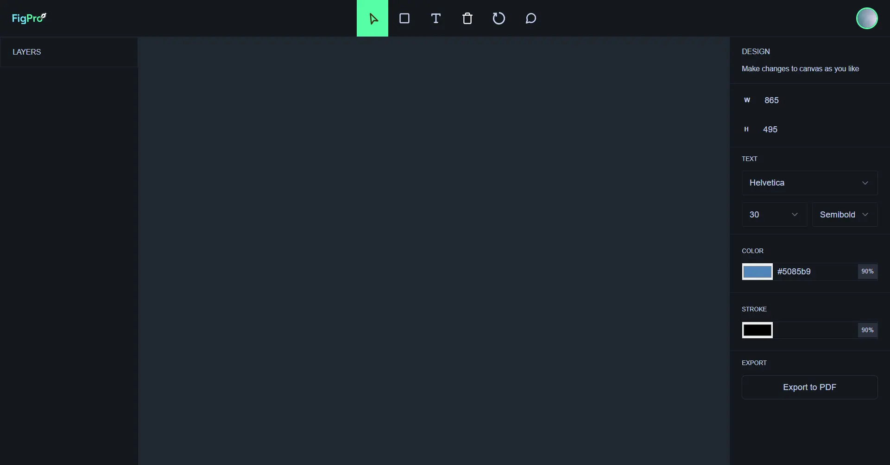

<div align="center">
    <a href="https://figpro-fv.vercel.app" target="_blank">
      
    </a>
  <h3 align="center">Real Time Figma Clone</h3>
</div>

##  <br /> 📋 <a name="table">Table of Contents</a>

- ✨ [Introduction](#introduction)
- ⚙️ [Tech Stack](#tech-stack)
- 📝 [Features](#features)
- 🚀 [Quick Start](#quick-start)

##  <br /> <a name="introduction">✨ Introduction</a>

**[EN]** A minimalistic Figma clone to show how to add real-world features like live collaboration with cursor chat, comments, reactions, and drawing designs (shapes, image upload) on the canvas using fabric.js.

**[FR]** 
Un clone minimaliste de Figma conçu pour illustrer l'intégration de fonctionnalités réalistes telles que la collaboration en temps réel avec chat de curseur, commentaires, réactions, ainsi que la création de designs (formes, téléchargement d'images) sur le canevas à l'aide de fabric.js.

##  <br /> <a name="tech-stack">⚙️ Tech Stack</a>

- **React** is a popular JavaScript library for building user interfaces, particularly single-page applications where data changes over time. React's component-based architecture allows developers to create reusable UI components, making development more efficient and the codebase easier to maintain. Its virtual DOM enhances performance by minimizing direct interactions with the browser's DOM.

- **Next.js** is a React framework known for its server-side rendering (SSR) and static site generation (SSG) capabilities, enhancing performance and SEO for web applications. It offers features like automatic code splitting, API routes for server-side logic, and a plugin system for extensibility.

- **TypeScript** is a statically typed superset of JavaScript that allows for early detection of errors and more robust, maintainable code. TypeScript's type system helps developers catch mistakes early during the development process, ensuring a more stable and reliable application.

- **Liveblocks** is a real-time collaboration platform that enables developers to integrate live features such as shared cursors, collaborative editing, and synchronized interactions across applications. It enhances user engagement and productivity by allowing simultaneous real-time updates and interactions, ensuring seamless collaboration and synchronized experiences.

- **Fabric.js** is a powerful JavaScript library that simplifies the creation and manipulation of HTML5 canvas elements. It provides a robust set of features for designing and editing graphics, including shapes, text, images, and animations. Fabric.js enhances the development of interactive applications by offering an intuitive API for handling canvas rendering and user interactions, making it ideal for implementing complex drawing functionalities in web applications.

- **Tailwind** is a utility-first CSS framework that speeds up UI development by providing a set of pre-built utility classes. It allows developers to quickly build custom designs without writing traditional CSS, promoting rapid prototyping and design consistency.

- **shadcn/ui** is as comprehensive React component library designed for creating modern and responsive user interfaces. ShadCN offers a wide range of pre-built, customizable components that adhere to best practices for accessibility and performance. Its intuitive API and well-documented components enable developers to build consistent and aesthetically pleasing UIs with ease.


## <br/> <a name="features">📝 Features</a>

👉 **Multi Cursors, Cursor Chat, and Reactions**: Allows multiple users to collaborate simultaneously by showing individual cursors, enabling real-time chat, and reactions for interactive communication.

👉 **Active Users**: Displays a list of currently active users in the collaborative environment, providing visibility into who is currently engaged.

👉 **Comment Bubbles**: Enables users to attach comments to specific elements on the canvas, fostering communication and feedback on design components.

👉 **Creating Different Shapes**: Provides tools for users to generate a variety of shapes on the canvas, allowing for diverse design elements

👉 **Uploading Images**: Import images onto the canvas, expanding the range of visual content in the design

👉 **Customization**: Allows users to adjust the properties of design elements, offering flexibility in customizing and fine-tuning visual components

👉 **Freeform Drawing**: Enables users to draw freely on the canvas, promoting artistic expression and creative design.

👉 **Undo/Redo**: Provides the ability to reverse (undo) or restore (redo) previous actions, offering flexibility in design decision-making

👉 **Keyboard Actions**: Allows users to utilize keyboard shortcuts for various actions, including copying, pasting, deleting, and triggering shortcuts for features like opening cursor chat, reactions, and more, enhancing efficiency and accessibility.

👉 **History**: Review the chronological history of actions and changes made on the canvas, aiding in project management and version control.

👉 **Deleting, Scaling, Moving, Clearing, Exporting Canvas**: Offers a range of functions for managing design elements, including deletion, scaling, moving, clearing the canvas, and exporting the final design for external use.


## <br /> <a name="quick-start">🚀 Quick Start</a>

Follow these steps to set up the project locally on your machine.

<br/>**Prerequisites**

Make sure you have the following installed on your machine:

- [Git](https://git-scm.com/)
- [Node.js](https://nodejs.org/en)
- [npm](https://www.npmjs.com/) (Node Package Manager)

<br/>**Cloning the Repository**

```bash
git clone {git remote URL}
```

<br/>**Installation**

Let's install the project dependencies, from your terminal, run:

```bash
npm install
# or
yarn install
```

<br/>**Set Up Environment Variables**

Create a new file named `.env` in the root of your project and add the following content:

```env
# Liveblocks
NEXT_PUBLIC_LIVEBLOCKS_PUBLIC_KEY=
```

Replace the placeholder values with your actual respective account credentials:

- [Liveblocks](https://liveblocks.io/)


<br/>**Running the Project**

Installation will take a minute or two, but once that's done, you should be able to run the following command:

```bash
npm run dev
# or
yarn dev
```

Open [`http://localhost:3000`](http://localhost:3000) in your browser to view the project.